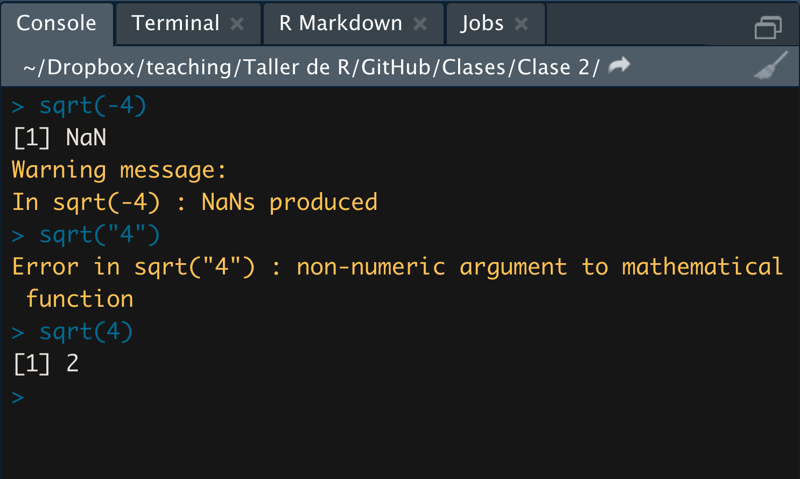
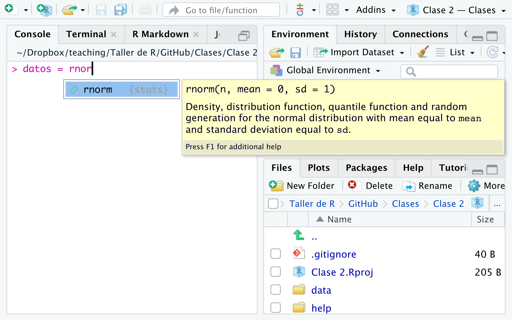
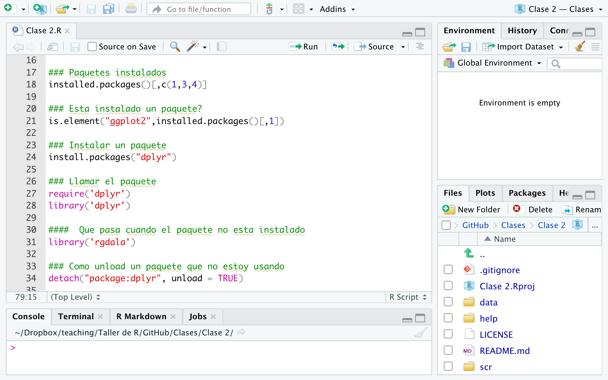
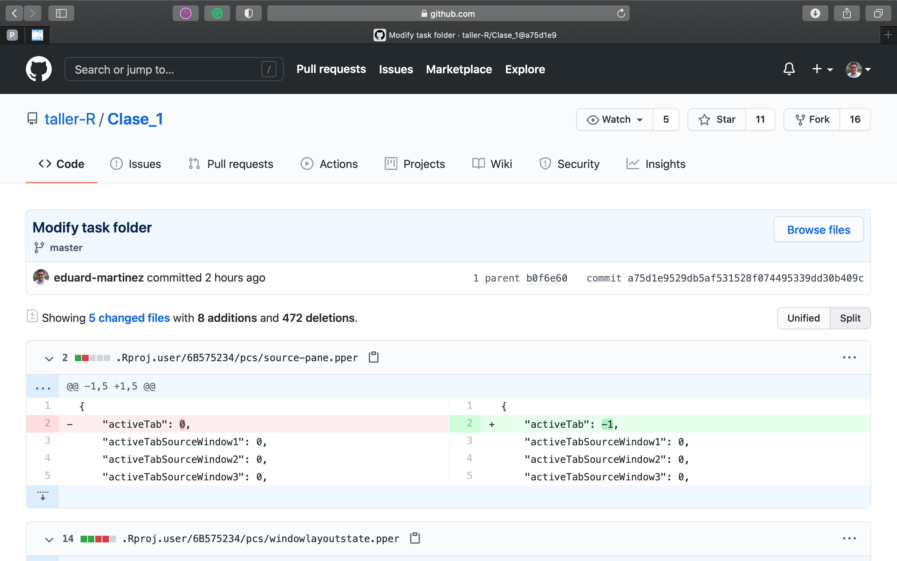

```{r setup, include=FALSE}
library(tidyverse)
options(htmltools.dir.version = FALSE)
library(knitr)
opts_chunk$set(
  fig.align="center",  
  fig.height=4, #fig.width=6, out.width="748px", out.length="520.75px",
  dpi=300, #fig.path='Figs/',
  cache=T#, echo=F, warning=F, message=F
  )
```

# Contenido

1. [Rstudio](#rstudio)
   
   1.1. Interfaz de Rstudio
   
   1.2. Decoding messages

2. [Use R!](#use_r)
   
   2.1. Sintaxis de R
   
   2.2. Editor de sintaxis
   
   2.3. Librerías

3. [Git y GitHub](#github)

   3.1. Qué es Git y GitHub?
   
   3.2. Flujo de trabajo


<!--------------------->
<!--- Interfaz de Rstudio --->
<!--------------------->
---
class: inverse, center, middle
name: rstudio

# Rstudio

<html><div style='float:left'></div><hr color='#FF007F' size=1px width=796px></html>

[RStudio](https://rstudio.com) es un entorno de desarrollo integrado para el lenguaje de programación [R](https://www.r-project.org), dedicado a la computación estadística y gráficos.  

---
# Interfaz de Rstudio

<div align="center">

</div>

---
# Cambiar la apariencia de Rstudio

<div align="center">

</div>

---
# Decoding messages

`Warning` y `message`: estas notificaciones se muestran sobre la consola y pueden generarse después de aplicar algunas funciones. Generalmente indican que hay detalles de la función que debemos tener en cuenta, pero no se detiene la ejecución de la función.

`Error:` esta notificación se muestran sobre la consola y se genera cuando ocurrió un error importante, por lo que la función no sigue ejecutándose.

<div align="center">

</div>


<!--------------------->
<!---    Use R    --->
<!--------------------->
---
class: inverse, center, middle
name: use_r

# Use R!

<html><div style='float:left'></div><hr color='#FF007F' size=1px width=796px></html>


---
# En R ...

1. Todo en R es un objeto.

2. Todo en R tiene un nombre.

3. Se usan funciones para crear, editar, transformar o eliminar objetos.  

4. Los objetos se almacenan temporalmente en el entorno o la memoria activa de R.

5. Todas las funciones han sido escritas anteriormente por otros colaboradores en paquetes o librerías que debemos "llamar" cada vez que se vayan a usar.

6. Para crear un objeto en R: 

   **nombre objeto** + **asignar** + **funcion()**

```{r1, include=T,eval=F}
# De esta forma
datos <- rnorm(n = 10 , mean = 50 , sd = 10)

# O esta forma
data = rnorm(n = 10 , mean = 40 , sd = 10)
```
---
# Workflow en R

<div align="center">

</div>
Tomado de: R para principiantes.

---
# Entorno de R:

El entorno de trabajo de R almacena temporalmente los objetos que se crean durante una sesión. El espacio de trabajo puede ser guardado o no al momento de cerrar la sesión. 

<div align="center">

</div>

---
# Funciones:

Las funciones permiten crear, editar, transformar o eliminar objetos. Estan contenidas en librerías. Y cada función contiene alemnos 1 argumento.

<div align="center">

</div>


---
# Editor de sintaxis:

El editor de código o editor de sintaxis nos permite escribir las instrucciones que queremos ejecutar en R. Para ejecutarlas debemos sombrear toda la linea que queremos ejecutar y orpimir las teclas `Control` + `Enter` o haciendo clik en `run`.

<div align="center">

</div>

---
# Librerías

Em R se pueden gestionar más de 17.000 librerías disponibles en el cran y otras miles más disponibles en GitHub. Para gestionar las librerias en R debemos:

<div align="center">

</div>

<!--------------------->
<!---    gitHub    --->
<!--------------------->
---
class: inverse, center, middle
name: github

# Git y GitHub

<html><div style='float:left'></div><hr color='#FF007F' size=1px width=796px></html>


---
# Qué es Git y GitHub?

## Git: 

- Git es un sistema de control de versiones distribuido. 

- Bien, intente esto: Imagínese si Dropbox y la función "Seguimiento de cambios" en MS Word tuvieran un bebé. Git sería ese bebé.

- De hecho, es incluso mejor que eso porque Git está optimizado para las cosas en las que los economistas y los científicos de datos pasan mucho tiempo trabajando (por ejemplo, el código).

- Hay una curva de aprendizaje, pero les prometo que vale la pena.

## GitHub:

- Es importante darse cuenta de que Git y GitHub son cosas distintas.

- GitHub es una plataforma de alojamiento en línea que proporciona una variedad de servicios integrados en el sistema Git. (Las plataformas similares incluyen Bitbucket y GitLab).


---
# Workflow en GitHub

<div align="center">

</div>

---
# Trabajo colaborativo en GitHub

<div align="center">

</div>

---
# Trabajar en un repositorio de GitHub

<div align="center">

</div>

---
# Antes de trabajar en un repositorio local..

<div align="center">

</div>

---
# Después de trabajar en un repositorio local..

<div align="center">

</div>

---
# Como usar Git...

<div align="center">

</div>


---
# Guardando los cambios de mi repositorio local a mi repositorio en GitHud

Sobre la terminal escribimos:

- 1. Marcamos todos los archivos que queremos agregar al repositorio:

`git add -A`

- 2. Etiquetar los cambios con un comentario:

`git commit -m 'Escribir comentario'`

- 3. Subir los cambios al repositorio online:

`git push`


<!--------------------->
<!---    Hoy vimos  --->
<!--------------------->
---
class: inverse, center, middle

# Hoy vimos...
<html><div style='float:left'></div><hr color='#FF007F' size=1px width=796px></html>

---
#  Hoy vimos...

## ☑ Interfaz de Rstudio

## ☑ Decoding messages en RStudio

## ☑ Sintaxis de R

## ☑ Librerías

## ☑ Flujo de trabajo en Git
